# Cacaco & Chocolate supply chain project
This repository contains an Ethereum DApp the demonstrates a Supply Chain flow from the moment a cacao farmer harvests the beans, to the moment a consumer purchases the chocolate made with those beans.

## Deployment on Rinkeby Test Network

The project has been deployed on the following contract address:
"0xA7461ee73b9776716e03Fe44BB3a3d7C9597C7DE"
[etherscan contract page](https://rinkeby.etherscan.io/address/0xa7461ee73b9776716e03fe44bb3a3d7c9597c7de)

It was deployed in the following transaction
"0x0192ca66330dcb229a1041583c5356691d8a8ce72110ff99e77c3df741281377"
[etherscan transaction page](https://rinkeby.etherscan.io/tx/0x0192ca66330dcb229a1041583c5356691d8a8ce72110ff99e77c3df741281377)

## Program version numbers
Truffle v5.2.3 (core: 5.2.3)
Solidity v0.5.16 (solc-js)
Node v10.19.0
Web3.js v1.2.9

## Roles
There are 4 different roles in this DApp, apart from the owner of the contract:
- Farmer => A Farmer is able to harvest beans and provide the batch with the data of the Farm (Name, Information, Latitude and Longitude, as well as Notes about the bacth itself). After harvesting them, the Farmer is able to process them, pack them and then set a price and put them for sale.
- Factory => A Factory is able to buy beans which are for sale, grind them, make chocolate and them ship the chocolate to a Distributor of their choice. 
- Distributor => A Distributor is able to receive chocolate, give it a brand of their choice and put it up for sale.
- Consumer => A Consumer is able to purchase chocolate from a Distributor

## Activity Diagram

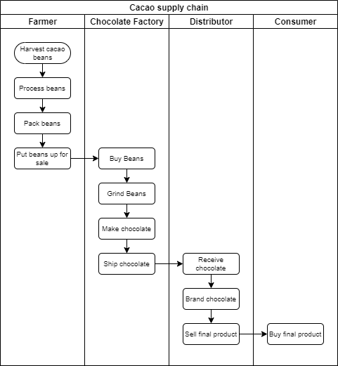

## Sequence Diagram

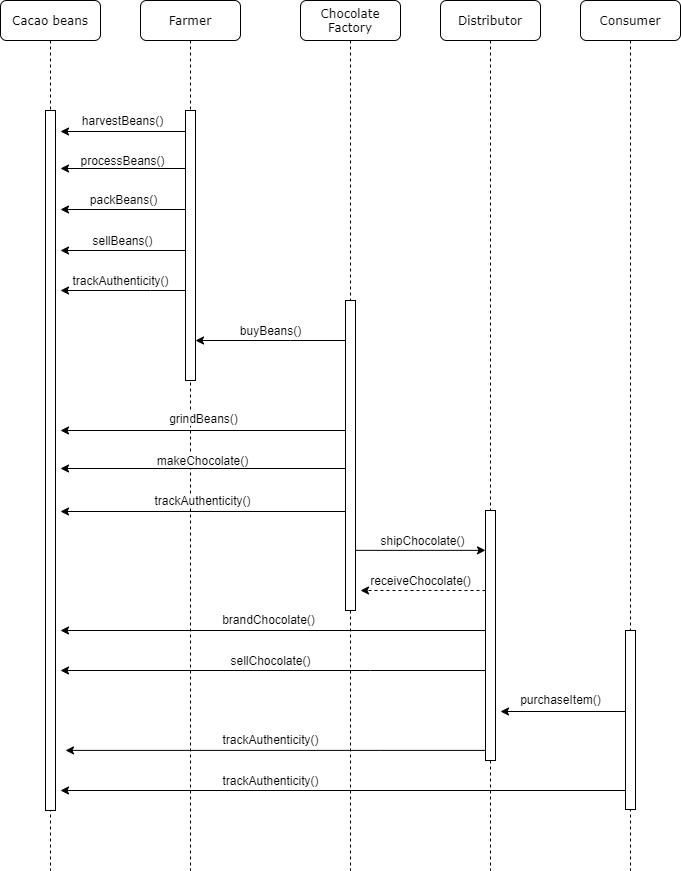

## State Diagram

## Classes

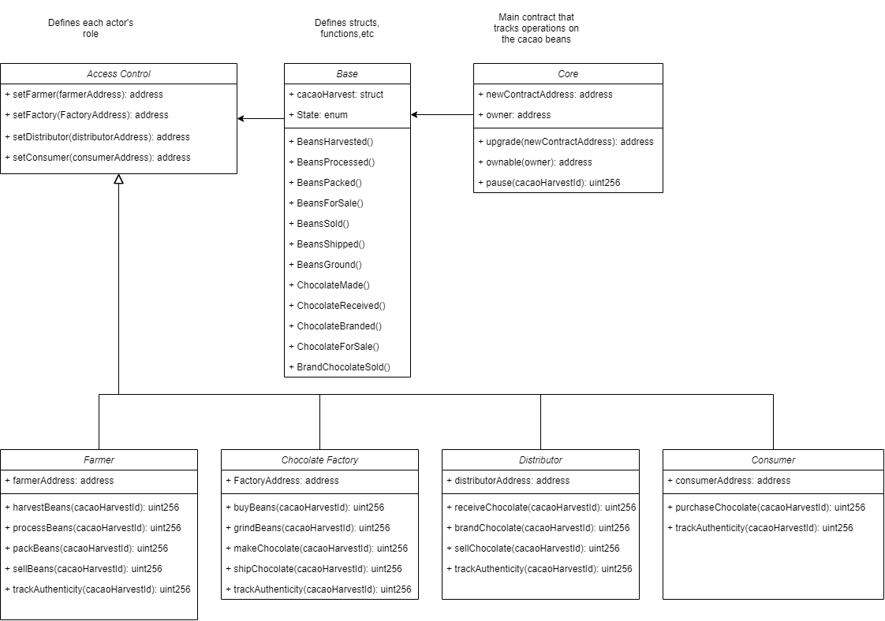

## Frontend functionality
The frontend allows to try all functionailities of the Supply Chain. 

It is divided into 8 sections.

### Product Overview
The product overview allows to set the SKU and UPC of the batch we want to either process or view. The 'Fetch Data' button allows to view all the details of a certain batch on the 'Product Details' section
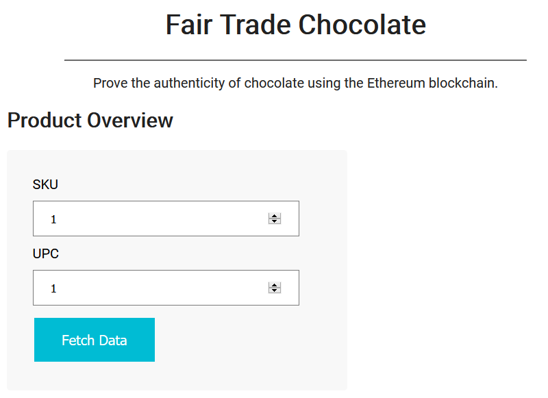

### Role management
This section allows to interact with the roles of the smart contract and add new addresses to the different roles of the Supply Chain. From this section it is possible to add a new farmer, a new distributor or a new consumer.
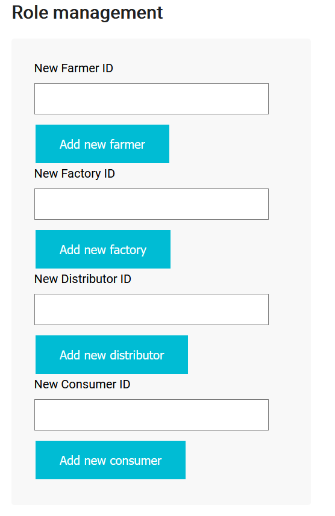

### Product Details
Here it is possible to visualize all the different attributes of a specific batch. We select the batch we want to see in the 'Product Overview' section and click on the 'Fetch Data' button. This button calls a javascript function which collects all data from the fetchItemBufferOne, fetchItemBufferTwo and fetchItemBufferThree functions of the smart contract.
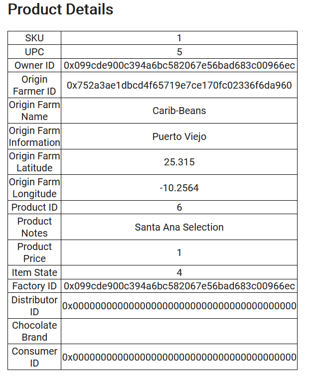

### Farm Details
Here the farmer is able to add the information about the farm. This information will remain unchanged for that specific batch of beans/chocolate
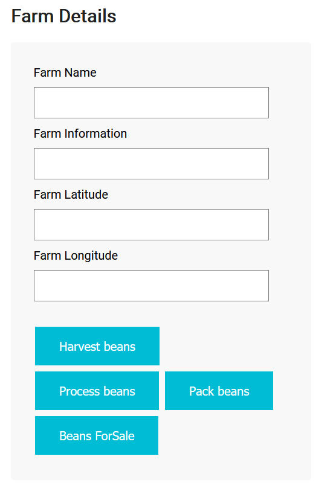

### Cacao Beans Details
This section allows the farmer to input the information about a specific batch of beans (Product Notes), as well as the price for that batch.
It also contains the 'Buy beans' button which allows a factory to buy a batch of beans. After this, the factory is able to use the 'Grind beans' and 'Make chocolate' functions.
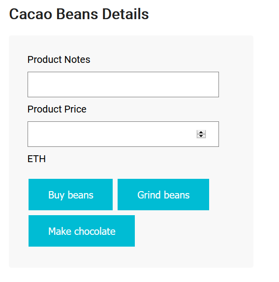

### Send Chocolate to Distributor
This field is used by a factory to send a batch of chocolate to a distributor
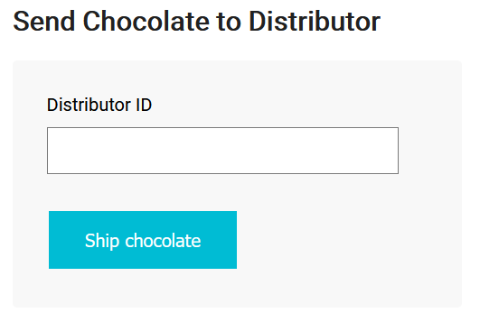

### Receive, Brand and Sell Chocolate
In this section a distributor is able to use the 'Receive chocolate' function, define a chocolate brand for a btach of chocolate and put it up for sale.
The 'Purchase chocolate' button is used by the consumer to buy chocolate
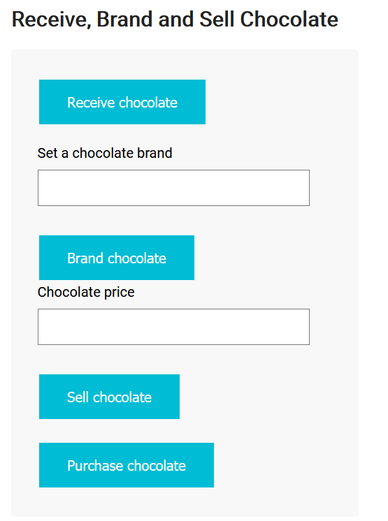

### Transaction History
Here is possible to see all the events generated during a session interactin with the supply chain
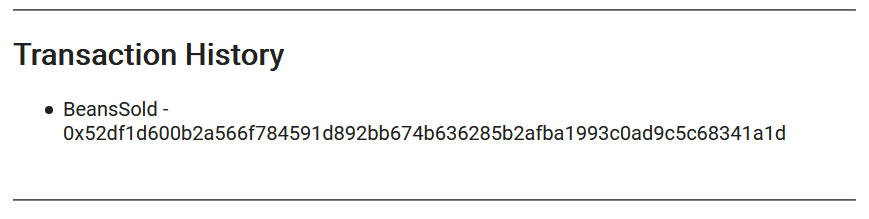

## Areas for further development
There is a couple of areas which could be improved by dedicating some more time to the project:
- Improve functionality of transfer of chocolate between the factory and the distributor. At this moment the factory ships the chocolate to the distriutor they choose, regardless of whether that distributor wants the batch or not. Once the shipment function is called successfully, it is only up to the distributor to receive the chocolate and move it up the chain. It isn't possible for them to reject the shipment-
- Improve frontend. The frontend could be improved with better visuals and the use of images for each product. Also The different sections could be distributed in different pages depending on the role of the user.

## Built With

* [Ethereum](https://www.ethereum.org/) - Ethereum is a decentralized platform that runs smart contracts
* [IPFS](https://ipfs.io/) - IPFS is the Distributed Web | A peer-to-peer hypermedia protocol
to make the web faster, safer, and more open.
* [Truffle Framework](http://truffleframework.com/) - Truffle is the most popular development framework for Ethereum with a mission to make your life a whole lot easier.

## Acknowledgments

* Solidity
* Ganache-cli
* Truffle
